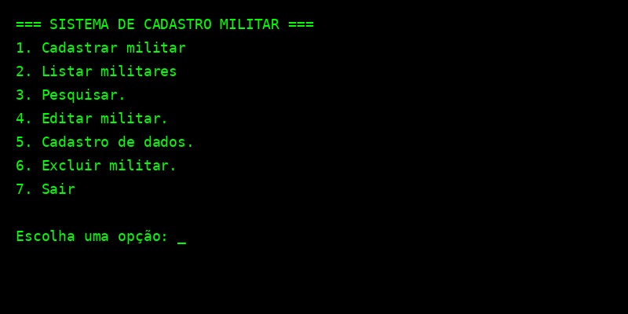

# 📋 Sistema de Cadastro Militar em Terminal


Projeto desenvolvido em Python com foco em organização, prática de lógica, e persistência de dados via JSON.  
Ideal para reforçar fundamentos de programação, modularização e interação em terminal.

---

## ✨ Funcionalidades

✅ Cadastro completo de militares com:
- Nome completo e de guerra
- CPF, PREC-CP, IDT Militar
- Posto/Graduação com ordenação por prioridade
- Dados bancários com seleção e validação

✅ Operações:
- Listar militares com ordenação
- Buscar por nome (ignora acentos e aceita buscas parciais)
- Editar qualquer campo do militar de forma segura
- Excluir militar com confirmação
- Cadastro dinâmico de novos bancos e graduações

---

## 💻 Tecnologias

- Python 3
- JSON (para persistência local)
- Interface via Terminal (CLI)

---

## 🚀 Como executar

1. Clone o repositório:

```bash
git clone https://github.com/OtavioClemente-bit/SISTEMA-DE-CADASTRO-MILITAR-EM-TERMINAL.git
cd SISTEMA-DE-CADASTRO-MILITAR-EM-TERMINAL
```

2. Execute o sistema:

```bash
python main.py
```

> O arquivo `militares.json` será criado automaticamente se não existir.

---

## 📂 Estrutura

```
├── main.py               # Código principal do sistema
├── militares.json        # Base de dados em JSON
├── sistema_terminal_preview.png  # Imagem de demonstração
└── README.md             # Documentação do projeto
```

---

## 🙋‍♂️ Desenvolvido por

**Otavio Clemente**  
🔗 [GitHub: @OtavioClemente-bit](https://github.com/OtavioClemente-bit)  
🚀 Em transição de carreira para área de desenvolvimento  
💬 Vamos conversar sobre oportunidades e projetos!

---

## 📸 Preview do sistema

> Interface em terminal limpa e funcional, com feedback visual e navegação simples.


